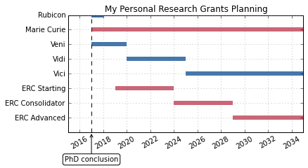

# This is my planning to apply for research grants 


```python
import pandas as pd
import numpy as np
import matplotlib.pyplot as plt
```


```python
df = pd.read_csv('grants.csv', sep=';')
phd_conclusion=2017
```


```python
fig = plt.figure(figsize=(6, 3))

ax = plt.subplot2grid((1,1), (0,0))

color_mapper = np.vectorize(lambda x: {'NWO':'#4477AA', 'H2020':'#CC6677'}.get(x))

plt.hlines(df.index, df['from'], df['till'],linewidths=6,colors=color_mapper(df['funder']))

plt.yticks(range(len(df['grant'])+1),df['grant']) #Y-axis as stringvector
plt.xticks(np.arange(2016, 2036, 2), rotation=30) #xticks


plt.axvline(phd_conclusion,color='k', linestyle='--') #Vertical line
ax.annotate("PhD conclusion", 
            xy=(2017, 8), 
            xytext=(2017, 10), 
            horizontalalignment='center',   
            bbox=dict(boxstyle="round", fc="w"),
            arrowprops=dict(arrowstyle="->"))

ax.grid(True,color='gray')

ax.invert_yaxis()
plt.title('My Personal Research Grants Planning')

fig.savefig('planning_research_grants.eps', bbox_inches='tight',format='eps', dpi=1200)
```




